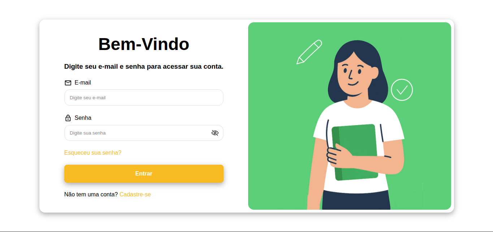
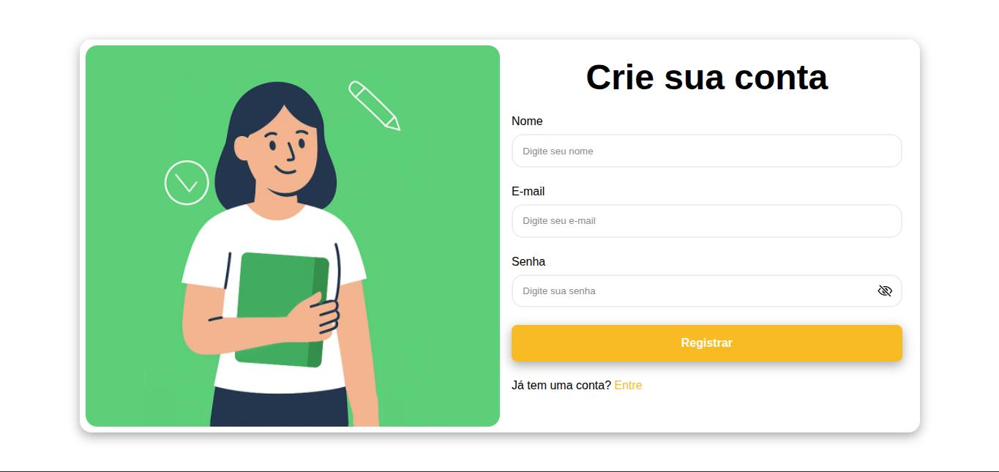
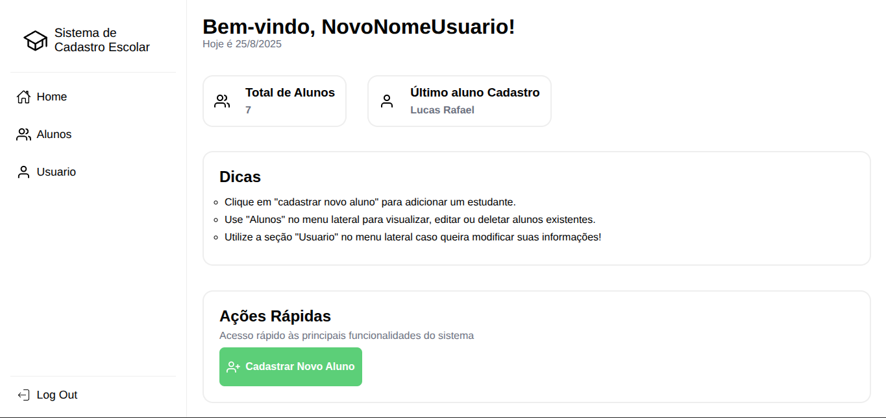
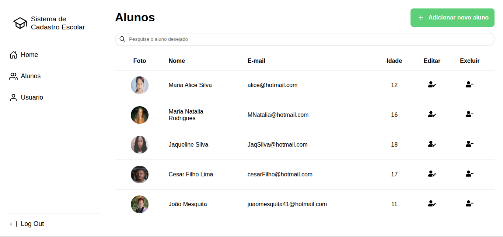
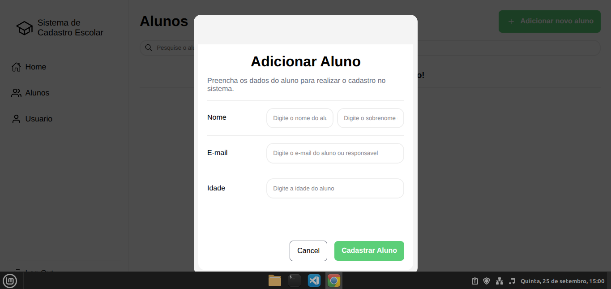
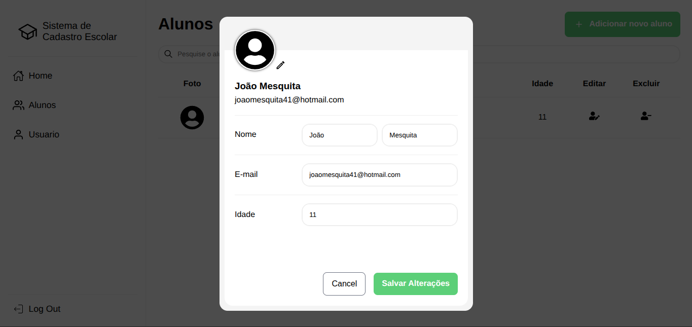
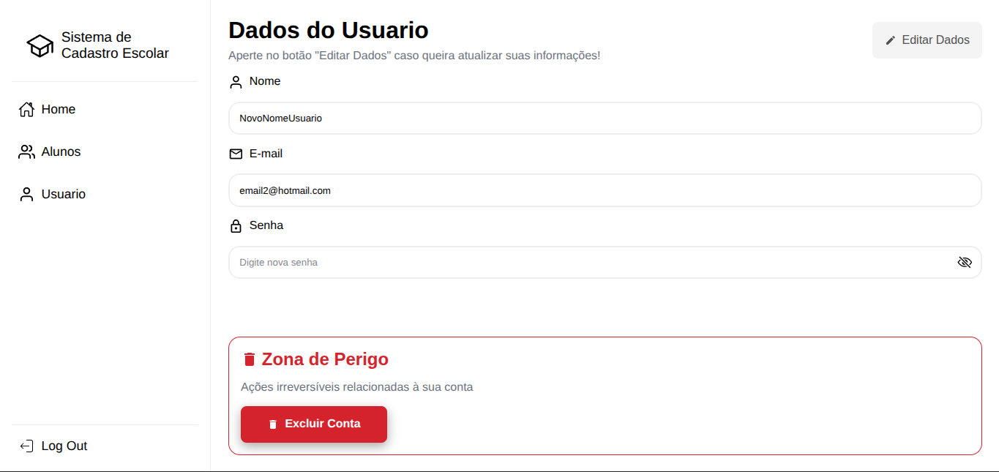

# 📚 Sistema de Cadastro Escolar

Um sistema web para gerenciamento de usuários e alunos. Permite o cadastro, autenticação e controle de acesso de usuários, além do cadastro completo de alunos com possibilidade de edição, exclusão e upload de foto de perfil.

## 🚀 Funcionalidades

- 🔑 Autenticação de usuários (login e registro)
- 👩‍🎓 CRUD de alunos (cadastrar, listar, editar e excluir)
- 🖼️ Upload de imagem de perfil para cada aluno
- 👨‍💻 Painel administrativo com gerenciamento centralizado
- 📊 Tela inicial com cards informativos (resumos e atalhos)
- ⚡ Integração com banco de dados

## 🛠️ Tecnologias Utilizadas

### Frontend

- ⚛️ React.js
- 🎨 Styled Components (ou CSS Modules)
- 🌐 React Router DOM
- 🗂️ Redux Toolkit (para autenticação e estado global)

### Backend

- ☕ Node.js
- 🚀 Express.js
- 🗃️ PostgreSQL (via Sequelize)
- 🔒 JWT (para autenticação)

## ⚙️ Como Rodar o Projeto

### 1️⃣ Clonar o repositório

```bash
git clone https://github.com/PauloRobertt/sistema-de-cadastro-escolar.git
cd sistema-de-cadastro-escolar
```

### 4️⃣ Configurar variáveis de ambiente

```bash
# Criar um arquivo `.env` no backend com as variaveis

PORT=3001
DB_HOST=localhost
DB_USER=seu_usuario
DB_PASS=sua_senha
DB_NAME=sistema_escolar
JWT_SECRET=segredo_super_seguro
```

## 🖼️ Telas do Sistema

### 🔑 Login & Registro




### 🏠 Home


.png>)

### 👩‍🎓 Gerenciamento de alunos

.png>)




### ⚙️ Configurações de usuário



## 📜 Licença

Este projeto está sob a licença MIT – sinta-se à vontade para usar e contribuir!
